# Instalação do MySQL 8.0

Este tutorial demonstra como realizar a instalação do MySQL 8.0 no Windows. O tutorial consiste na instalação do MySQL Server e do Workbench. É importante também realizar os passos pós-instalação de configuração das variáveis de ambiente, para o correto funcionamento da ferramenta.

1. Na tela inicial de instalação, selecione a opção **Custom** e clique em **Next**.

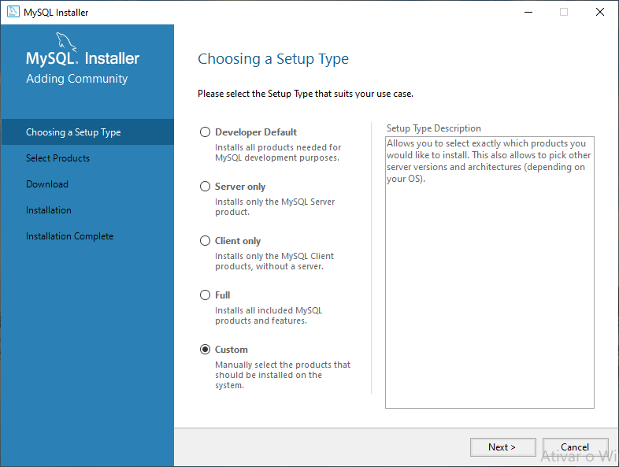

2. Selecione o **MySQL Server** e o **MySQL Workbench** para instalação e avance para a próxima tela.

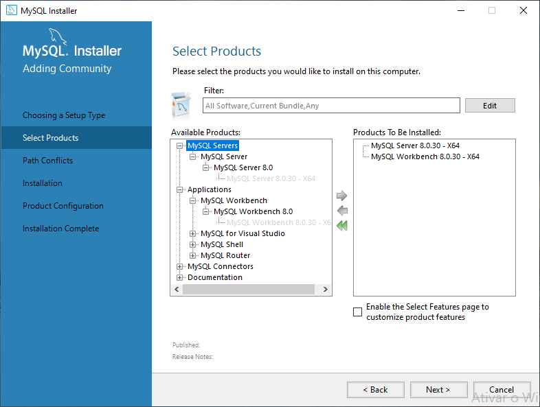

3. Clique em **Execute** para iniciar a instalação.

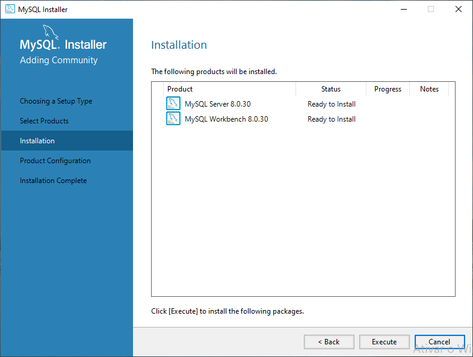

4. Após completar a instalação, clique em **Next**.

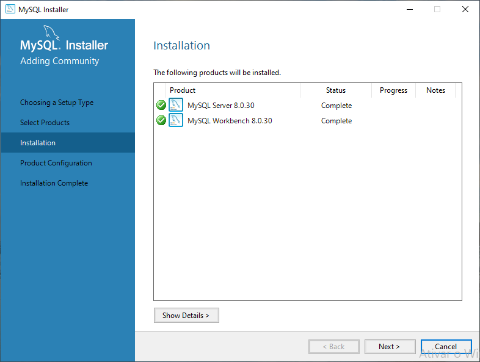

5. Na tela de configuração do produto, clique em **Next**.

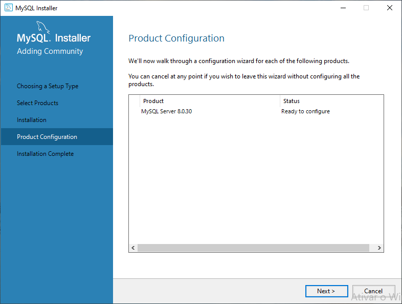

6. Mantenha as **configurações padrão** conforme a figura.

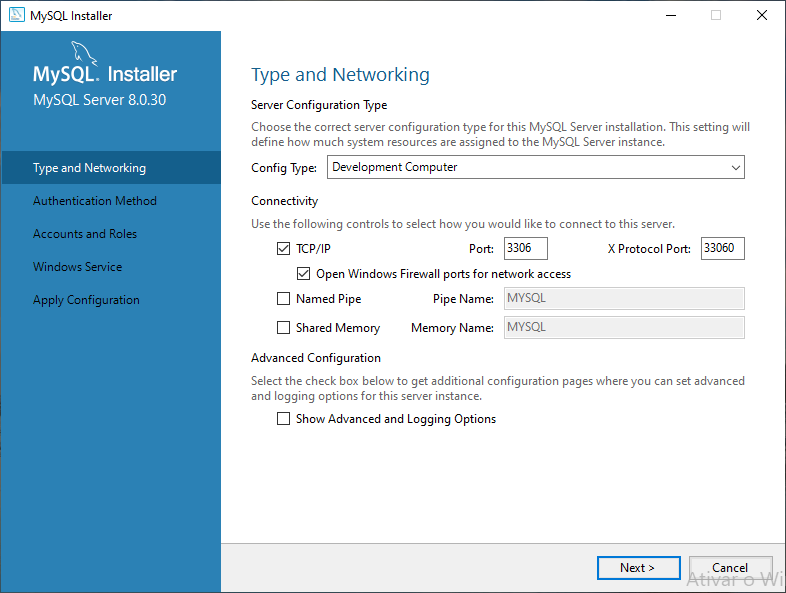

7. Na configuração do método de autenticação, mantenha a **opção recomendada**.

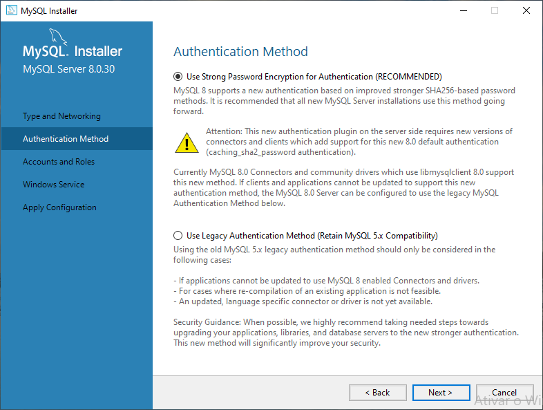

8. Defina uma senha para o usuário root (que pode ser igual ao nome de usuário) e clique em **Next**.

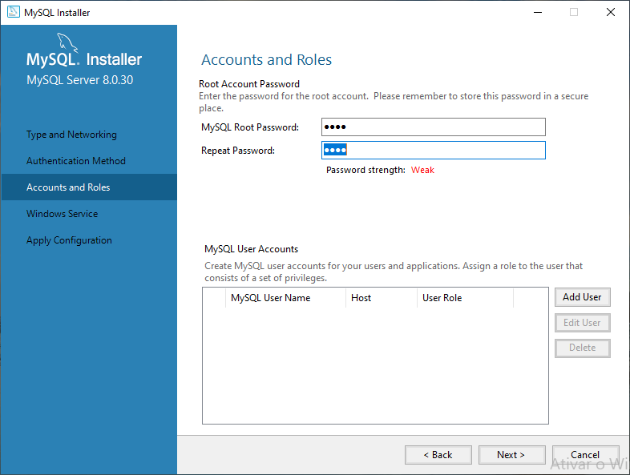

9. Mantenha as **configurações padrão** na tela de configuração do serviço do Windows.

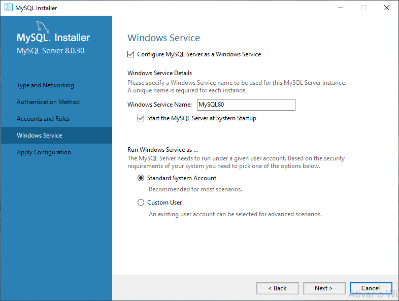

10. Clique em **Execute** para aplicar as configurações.

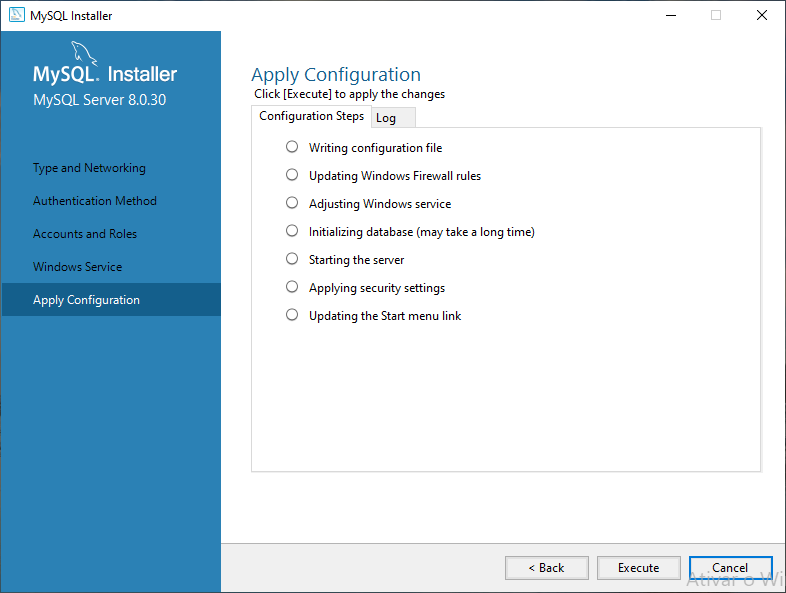

11. Quando todas as tarefas de configuração estiverem concluídas, clique em **Finish**.

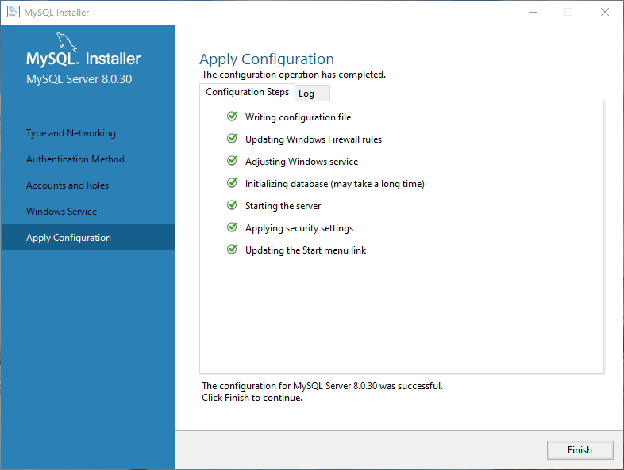

12. A tela seguinte deve indicar que a configuração o MySQL está completa. Clique em **Next**.

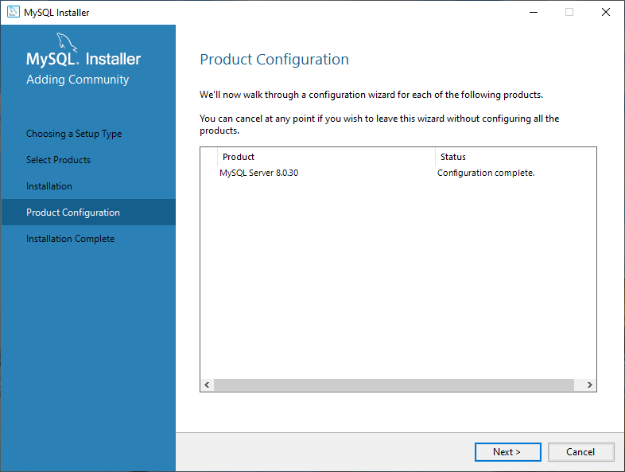

13. Para concluir o processo de instalação, clique em **Finish**.

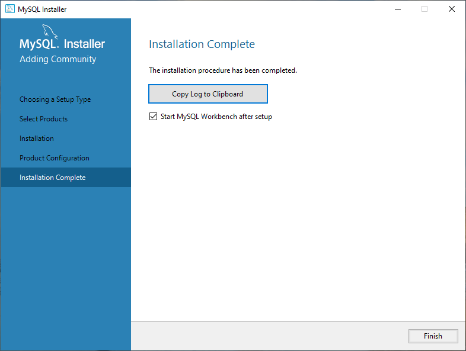

14. Inicie o aplicativo para editar as **variáveis de ambiente do sistema**.

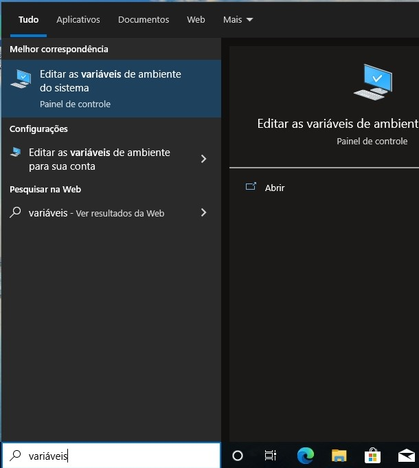

15. Clique no botão **Variáveis de Ambiente**.

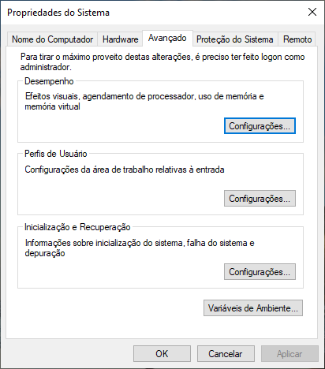

16. Na lista de **variáveis do sistema**, selecione a variável **Path** e clique em **Editar**.

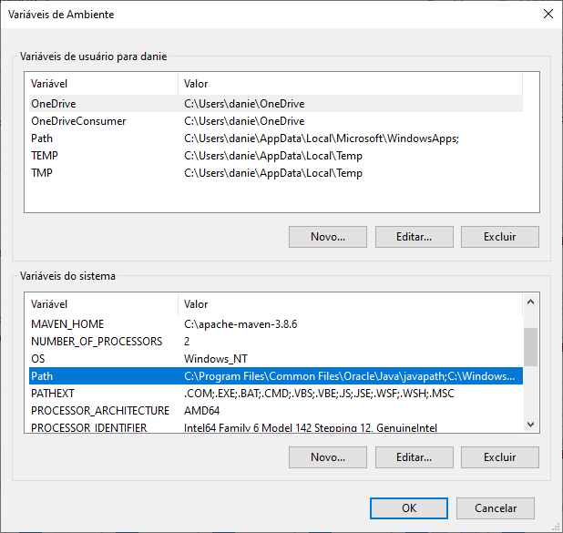

17. Adicione na lista o caminho para a pasta de **bin** no diretório de instalação do MySQL. Na instalação padrão, o diretório deve ser **C:\Program Files\MySQL\MySQL Server 8.0\bin**. Em seguida, confirme a alteração clicando em **OK** nesta tela e nas demais, até encerrar o aplicativo de configuração.

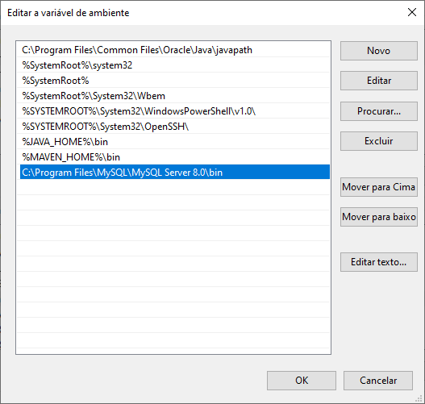
